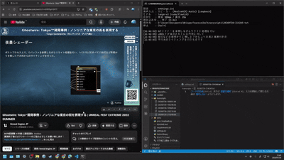

# WhisperTranscribe

PC で鳴っている音声を Whisper (large-v3) でリアルタイム文字起こしして、テキストに保存する。
オンライン講演やリモート会議の記録用。ライブ キャプション (Win+Ctrl+L) は不要。



## 動作条件

| | |
|---|---|
| OS | **Windows 10 / 11** — WASAPI ループバックを使うため Mac・Linux では動かない |
| ↑ | 特定のアプリだけを拾う `app` 設定は **Windows 11 が必要**（ビルド 20348 以降）。Windows 10 は 22H2 でもビルド 19045 で対応していない。`app` を空欄にすれば Windows 10 でも従来どおり使える |
| GPU | **NVIDIA (CUDA)** — VRAM 6GB 以上（8GB 以上を推奨）。AMD / 内蔵 GPU は不可 |
| ドライバ | CUDA 12 対応（Windows 527.41 以降）。ここ数年更新していれば問題ない |
| Python | 3.10 〜 3.12（3.12 で動作確認） |
| ディスク | 約 5GB（モデル 2.9GB + ライブラリ） |

VRAM が足りない場合は `settings.ini` で `compute = int8_float16`（消費が約半分）、
それでも厳しければ `model = large-v3-turbo` にする。

## 導入（初回だけ）

### 1. Python を入れる

[Python 3.12.10 のダウンロードページ](https://www.python.org/downloads/release/python-31210/)
を開き、ページ下部の **Windows installer (64-bit)** をクリックして実行する。

> インストーラ最初の画面の **「Add python.exe to PATH」に必ずチェックを入れる**。
> ここを忘れると次の手順で失敗する。

すでに Python が入っている人はこの手順を飛ばしてよい。コマンドプロンプトで
`python -V` と打って `Python 3.1x.x` と出れば入っている。

### 2. フォルダを置く

配布された `WhisperTranscribe` フォルダを好きな場所にコピーする。C ドライブでなくてよい。
パスに日本語が混じらない場所を推奨。

このフォルダの**中に** `venv\`（約 2GB）と `models\`（2.9GB）が作られ、文字起こし結果も
`transcripts\` に溜まっていく。最終的に 5GB 前後になるので、Downloads や一時フォルダ
ではなく、置きっぱなしにできる場所に展開すること。
（GitHub から ZIP で落とした場合は `WhisperTranscribe-main\` という名前で展開される）

### 3. `セットアップ.cmd` をダブルクリック

専用の Python 環境を作り、必要なライブラリを入れる。数分かかる。
「完了」と出れば終わり。

### 4. `文字起こし開始.cmd` をダブルクリック

初回だけモデル（約 2.9GB）のダウンロードが走るので 5〜15 分ほど待つ。
2 回目以降は数秒で起動する。

うまくいかないときは末尾の[トラブル](#トラブル)を見る。

## 使い方

`文字起こし開始.cmd` をダブルクリック。停止は `Ctrl+C`。

- `文字起こし開始.cmd` … PC で鳴っている音だけを文字起こし
- `文字起こし開始-マイクも含む.cmd` … 自分のマイクも文字起こしし、各行に `[SYS]` / `[MIC]` を付ける

保存先は `transcripts\YYYYmmdd-HHMMSS.txt`（UTF-8 BOM 付き、1 文 1 行、行頭に時刻）。
認識できた分は都度書き込まれるので、途中でウィンドウを閉じても直前までは残る。

## 設定

**`settings.ini`** をメモ帳などで編集する。行頭が `;` の行はコメント。
値を空欄にした項目は既定値のまま。書き間違えた項目はそこだけ無視され、起動時に警告が出る。

よく触るのはこの 4 つ。

| 項目 | 説明 |
|---|---|
| `prompt` | 固有名詞や専門用語を並べる。誤認識対策の主役 |
| `app` | 特定のアプリの音だけを拾う。空欄なら PC で鳴っている音すべて |
| `max_segment` | 反応の速さと精度のつまみ。`25`=精度優先 / `12`=ほどよい / `8`=反応優先 |
| `min_silence` | 区切る無音の長さ(ms)。短いと早く出るが、文が細かく切れる |

`app` にはウィンドウタイトルの一部を書く（部分一致・大文字小文字は区別しない）。
指定できる名前は `文字起こし開始.cmd --list-apps` で確認できる。
**拾えるのはアプリ単位**で、ウィンドウやタブ単位では分けられないので、Chrome を指定すると
別タブの音も混ざる。分けたいものは別のアプリで開く（例: 講演は Chrome、YouTube は Edge）。
指定したアプリが見つからない場合は、黙って全体を拾わずにエラーで止まる
（違うものを録り続けて後から気づく事故を防ぐため）。

BGM が鳴り続ける素材では無音が来ないため、`max_segment` が実際の待ち時間を決める
（毎回この秒数フルに待ってから認識される）。逆に BGM のない講演や会議では文の切れ目で
無音が入るので `max_segment` はほとんど出番がなく、ここをいじっても体感は変わらない。
短くすると Whisper に渡る文脈が減るので、
1 行が「と思って」「何が違うんだろう」のように細かく途切れやすくなる。
落ち着いて読める記録が目的なら `max_segment = 25` / `min_silence = 700` 寄り、
喋っている横で眺めたいなら `8` / `400` 寄りにする。

## コマンドラインオプション

`settings.ini` で足りるので普段は不要。`.cmd` の後ろに付けると **ini より優先される**ため、
一時的に設定を変えて試したいときに使う。例:

```
文字起こし開始.cmd --prompt "アンリアルエンジン,シェーダー,ライトマップ" --echo
```

| オプション | 説明 |
|---|---|
| `--prompt "用語,人名"` | 固有名詞を渡すと認識がそちらに寄る。誤認識対策の主役 |
| `--app "CEDEC"` | そのウィンドウタイトルを含むアプリの音だけを文字起こし |
| `--list-apps` | `--app` に指定できるアプリ一覧を表示 |
| `--echo` | 認識結果を画面にも表示する（`settings.ini` の `echo` と同じ） |
| `--max-segment 8` | 区切りの最長秒数。反応を早くする |
| `--lang auto` | 言語自動判定（既定は `ja`） |
| `--model large-v3-turbo` | 速度優先のモデルに変更 |
| `--list-devices` | 使えるデバイス名の一覧を表示 |
| `--device-name "UAB-80"` | 別の再生デバイスの音を録る |
| `--mic-name "eMeet"` | 使うマイクを指定 |
| `--threshold 0.003` | 小さい音も拾う（既定 0.006） |
| `--min-silence 500` | 区切りを早くする（既定 700ms） |
| `--duration 3600` | 指定秒数で自動終了 |
| `--out D:\会議.txt` | 保存先を指定 |

## 構成

- 置き場所はどこでもよい（フォルダごと移動しても動く。`.cmd` は自分の位置を基準に動き、
  `venv` も相対的に解決される。ただし移動後は `venv\Scripts\pip.exe` が使えなくなるので、
  ライブラリ追加は `venv\Scripts\python.exe -m pip install ...` で行う）
- `settings.ini` … 設定（ここを編集すれば済むようにしてある）
- `transcribe.py` … 本体
- `proc_loopback.py` … 特定のアプリの音だけを取り出す部分（`app` 設定で使う）。
  Windows のプロセスループバック API を `ctypes` だけで叩いているので追加ライブラリは不要
- `requirements.txt` … 使うライブラリ。`セットアップ.cmd` が読む
- `venv\` … 専用の Python 環境（faster-whisper / PyAudioWPatch / scipy / CUDA ライブラリ）。
  **他人の PC にコピーしても動かない**（作成時の Python の場所を記憶しているため）。
  配布するときはこのフォルダを除いて渡し、受け取った側が `セットアップ.cmd` を実行する
- `models\` … モデルの実体（約 2.9GB）。`.cmd` が `HF_HOME` をここに向けているので
  C ドライブを消費しない。直接 `transcribe.py` を実行した場合も同じ場所を使う

## 仕組みと注意点

- WASAPI ループバックで**既定の再生デバイス**の音を取る。仮想オーディオドライバは不要。
  起動後に Windows 側で出力先を切り替えても追従しないので、切り替えたら再起動する
- 無音 0.7 秒で区切って認識する。BGM が鳴り続けている素材では無音が来ないため、
  最長 25 秒（`--max-segment`）で区切る。その際は末尾 1 秒のうち最も静かな位置を選んで切る
- Whisper は無音や BGM だけの区間で「ご視聴ありがとうございました」等を創作することがある。
  この種の定型句（`JUNK_PHRASES`）は、音量が小さい場合に加えて Whisper 自身の
  `no_speech_prob` が高い / `avg_logprob` が低い場合も捨てている。BGM が鳴っていると
  音量だけでは判別できないため
- 起動時にモデルを GPU に載せるため数秒かかる。喋り始める少し前に起動するとよい
- 発話とみなす音量の下限は、`threshold` と「無音区間から推定した暗騒音の 3 倍」の大きい方。
  暗騒音の更新を無音区間だけに限っているのは、講演のように喋りっぱなしの素材で
  推定値が発話音量まで上がってしまい、数分後から声を取りこぼすのを防ぐため

## トラブル

| 症状 | 対処 |
|---|---|
| セットアップで「Python が見つかりません」 | インストール時の **Add python.exe to PATH** の入れ忘れ。Python を入れ直すか、インストーラを再実行して Modify から追加する |
| `cublas64_12.dll not found` で落ちる | NVIDIA ドライバが古い。GeForce Experience / NVIDIA アプリから更新する |
| `CUDA out of memory` で落ちる | `settings.ini` で `compute = int8_float16`、それでも駄目なら `model = large-v3-turbo` |
| 何も認識されない・無音のまま | 音を出しているデバイスと Windows の既定の再生デバイスが食い違っている。`文字起こし開始.cmd --list-devices` で名前を確認し、`settings.ini` の `output_device` に指定する。起動後に出力先を切り替えた場合も再起動が必要 |
| 固有名詞が化ける | `settings.ini` の `prompt` に用語や人名を並べる。ここが誤認識対策の主役 |
| 表示が遅い | `settings.ini` の `min_silence` を 400 前後に。BGM のある素材なら `max_segment` も 8〜12 に下げる |
| 起動直後に「'○○' を含むウィンドウが見つかりません」 | `settings.ini` の `app` に書いた名前のアプリが起動していない。先にアプリを起動するか、`app` を空欄にして全体を拾う |
| `app` を指定すると `E_NOTIMPL` で落ちる | その Windows がプロセス単位のキャプチャに対応していない（Windows 10 はビルド 19045 まで非対応）。`app` を空欄にすれば従来どおり動く |
| 指定したアプリなのに別のタブの音が入る | 仕様。Windows の API はアプリ単位でしか分けられない。分けたい対象は別のブラウザで開く |

## チームに配るとき

`venv\` `models\` `transcripts\` `__pycache__\` を**除いて**渡す。
`venv\` は他人の PC では動かず、`transcripts\` には収録済みの中身が入っているため。

配る前に `settings.ini` の以下を空欄に戻しておく（自分用の値が残っていると、
受け取った人の環境ではエラーで止まる）。

- `app` … 起動していないアプリ名が残っていると起動直後にエラーで終了する
- `prompt` … 前回の題材の用語が残っていると、別の内容で誤認識を誘発する
- `output_device` / `mic_device` … 自分の機材名が残っていると意図しないデバイスを掴む

## ハマりどころ（対処済み）

- **Avast の HTTPS スキャン**が証明書を差し替えるため、モデル取得が SSL エラーで落ちた。
  `truststore` で Windows の証明書ストアを使うようにして解決（検証は有効のまま）
- CTranslate2 は実行時に名前で DLL を読むため、`os.add_dll_directory` だけでは
  `cublas64_12.dll not found` になる。`PATH` にも通す必要がある
- WASAPI ループバックは**何も再生されていない間データが流れない**。そのままだと
  最後の発話が溜まったまま出てこないので、1.5 秒データが来なければ区切る処理を入れている
